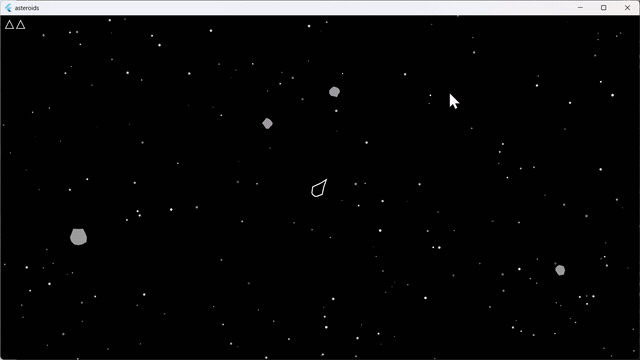

# Asteroids

**Old time ASTEROIDS - similar to the seventies arcade game. This project has really helped me to begin learning Flutter and Dart. It also helped me get my feet wet with VS Code.**

## Demo
- Classic Asteroids game made with [Flutter](https://flutter.dev/) and [Flame](https://flame-engine.org/)
- Inspired by the arcade game from the seventies

<p align="center">
  
</p>


## Tech Stack

- **Programming Language:** Dart
- **UI Framework:** Flutter
- **Game Engine:** Flame (`^1.32.0`)
- **Audio:** flame_audio (`^2.0.2`)
- **Icons:** cupertino_icons (`^1.0.8`)
- **Testing/Dev:** flutter_test, flutter_lints

## Dependencies

Core:
- `flutter`
- `flame`
- `flame_audio`
- `cupertino_icons`

Dev:
- `flutter_test`
- `flutter_lints`

See [`pubspec.yaml`](https://github.com/gregpuzzles1/asteroids/blob/main/pubspec.yaml) for detailed dependency versions.

## Assets

- Audio files are stored in `assets/audio/`
- Material design is enabled

## How to Play

1. **Run the game in a Flutter-supported environment (Mobile, Web, Desktop, depending on your setup).**
2. **Control your spaceship to avoid and destroy asteroids:**  
   - Use arrow keys or touch controls (depending on platform) to rotate and thrust your ship.
   - Shoot asteroids to break them into smaller pieces.
   - Avoid colliding with asteroids to survive as long as possible.
3. **Earn points for every asteroid destroyed.**

## Getting Started

1. **Install Flutter**: Download and install Flutter from the [official website](https://flutter.dev/docs/get-started/install).
2. **Clone the repository**:
   ```
   git clone https://github.com/gregpuzzles1/asteroids.git
   cd asteroids
   ```
3. **Get dependencies**:
   ```
   flutter pub get
   ```
4. **Run the game**:
   ```
   flutter run
   ```
   - For web: `flutter run -d chrome`
   - For mobile: `flutter run -d <device_id>`

## License

This project is licensed under the [MIT License](https://github.com/gregpuzzles1/asteroids/blob/main/LICENSE).

## Contributing

Beginner-friendly project. Contributions and suggestions are welcome!

---

**Author:** [gregpuzzles1](https://github.com/gregpuzzles1)
